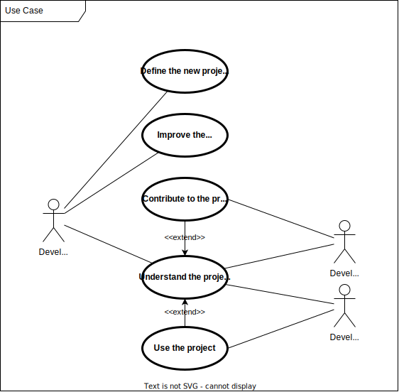
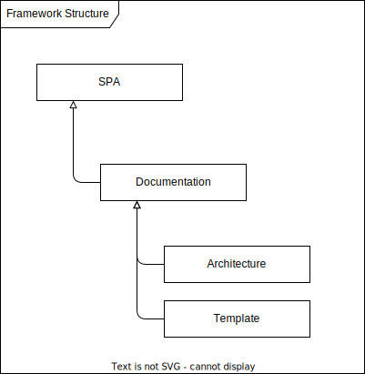

# Architecture

## What is the project about?

This project devines the Small Project Architecture Framework (SPA). This framework is intended to be used if you want to build a small project but don't want to miss some crucial detail in the beginning.

## Target User Of the Project

- Developers
- Open Source Contributors
- Project Managers

## Use Case

## Key Development Decisions

- Implement as a markdown template
- Must be minimalistic, but enough to cover the most important aspects

## Composition

...

### Testing Startegy

Testing by usage of the framework in a real projects.

### Physical Structure

Not applicable.

### Virtual Structure

Not applicable.

### System Conditions

Not applicable.

### System Logic

Not applicable.

### Documentation Structure

